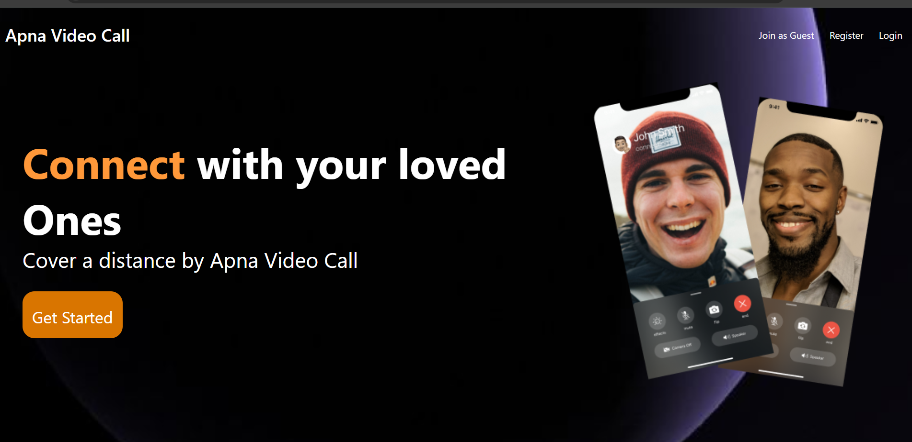

# MeetApp - A Zoom-like Video Conferencing Platform 🎥💬
## 🚀 Overview
MeetApp is a video conferencing platform similar to Zoom, offering seamless communication with essential features like video calling, guest access, screen sharing, and real-time messaging.

## ✨ Features
✅ **Video Calling** – High-quality video and audio communication.  
✅ **Guest Join & Authentication** – Users can sign up, sign in, or join as guests.  
✅ **Screen Sharing** – Share your screen effortlessly.  
✅ **Real-time Messaging** – Chat with participants during a call.  
✅ **Secure & Scalable** – Built with authentication and WebRTC for secure video calls.  

## 🛠️ Tech Stack
- **Frontend:** React.js, Tailwind CSS  
- **Backend:** Node.js, Express.js  
- **Database:** MongoDB  
- **Real-time Communication:** WebRTC, Socket.io  

## 📸 Screenshots


## 🚀 Getting Started
### 1️⃣ Clone the Repository
```bash
git clone https://github.com/jagrutigawade07/MeetApp.git
cd MeetApp
```

### 2️⃣ Install Dependencies
#### Backend
```bash
cd backend
npm install
```

#### Frontend
```bash
cd frontend
npm install
```

### 3️⃣ Run the Application
#### Start Backend Server
```bash
cd backend
npm start
```

#### Start Frontend Server
```bash
cd frontend
npm start
```

## 🏆 Contributing
Contributions are welcome! Feel free to open issues or submit pull requests.

## 📜 License
This project is licensed under the MIT License.

## 📩 Contact
For queries, reach out at [jagruti.a.gawade@gmail.com](mailto:jagruti.a.gawade@gmail.com) or connect on [LinkedIn](https://linkedin.com/in/jagruti-gawade).

---
⭐ If you like this project, don't forget to **star the repo!**
